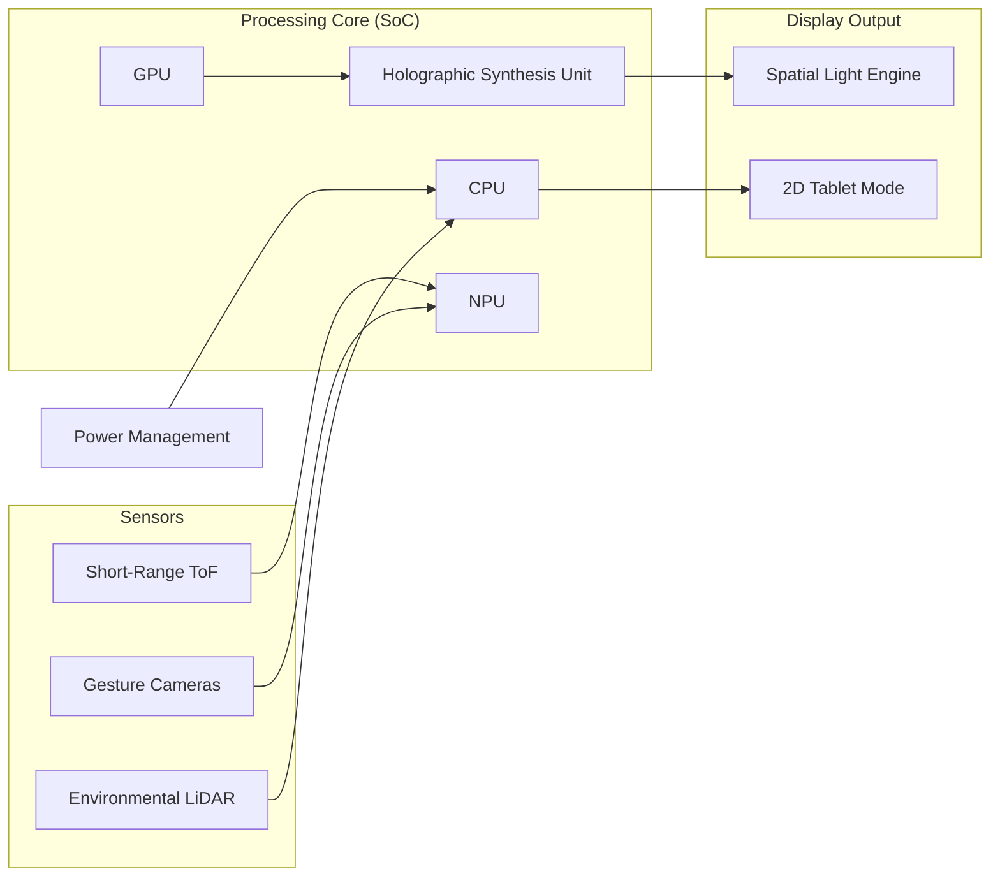

# Electronics, Sensors, and Power Systems

## Computing Architecture
BendingForce v2 requires significant computational power to calculate light fields in real-time.

### 1. System-on-Chip (SoC)
*   **Target:** High-end ARM-based architecture (e.g., custom silicon or top-tier commercial SoC like Apple M-series equivalent or NVIDIA Grace Hopper mobile variant).
*   **CPU:** 12+ Core architecture (Performance/Efficiency split).
*   **GPU:** Unified memory architecture with high TFLOPS (Teraflops) for 3D rendering.
*   **NPU (Neural Processing Unit):** Dedicated 50+ TOPS (Tera Operations Per Second) for AI-accelerated light field prediction and sensor fusion.

### 2. Spatial Rendering Pipeline
*   **Hardware Acceleration:** Real-time ray-tracing hardware and dedicated "Holographic Synthesis Units" (HSU) to calculate interference patterns for the SLE.

## Sensor Suite
Interaction with floating spatial objects requires low-latency depth and motion tracking.

### 1. Interaction Sensors
*   **LiDAR (Long Range):** For environment mapping (2m - 10m).
*   **Short-Range Time-of-Flight (ToF):** Dedicated sensor for the "Spatial Zone" (2cm - 50cm) above the screen to track hand/finger positions with sub-millimeter precision.
*   **Infrared Gesture Cameras:** Stereo-IR cameras for high-speed skeletal hand tracking.
*   **Capacitive Touch:** Integrated into the protective glass for standard 2D tablet interaction.

### 2. Environmental & Immersion Sensors
*   **Ambient Light Sensor (ALS):** Adjusts SLE brightness and fluorescent amplification levels based on surrounding light.
*   **IMU (Inertial Measurement Unit):** 9-axis tracking for spatial anchoring of images during device movement.
*   **Spatial Audio Array:** 4-speaker beamforming array with Dolby Atmos support to create "Sound-Out-of-Screen" to match the visual depth.
*   **Localized Haptics:** High-frequency voice-coil actuators integrated into the chassis to provide tactile feedback synchronized with 3D interactions.

## Power Strategy
Designed for high-performance and resiliency.

### 1. Apex-Class Battery System
*   **Type:** Dual-cell Ultra-High Density Silicon-Anode Lithium-Ion (Targeting 350 Wh/kg).
*   **Capacity:** 200 Wh (~54,000 mAh) — Built for 24-hour continuous 3D spatial rendering or 30-day standby in the field.
*   **Supercapacitor Buffer:** High-discharge supercapacitor array to handle transient power spikes (up to 150W) during complex "Crystal Lattice" reconstruction.

### 2. Fast-Charge & Energy Infrastructure
*   **Wired Charging:** Dual USB-C PD 3.1 (EPR) ports supporting up to 140W fast charging (0-80% in 45 minutes).
*   **High-Speed Wireless Charging:** Integrated Qi2-compliant magnetic induction coil for up to 65W wireless power delivery.
*   **Solar-Permissive External Docking:** Designed for seamless integration with high-output external tactical solar arrays (up to 200W) via the "Force-Link" connector.

## Connectivity
*   **Wireless:** Wi-Fi 7, Bluetooth 5.4, and 5G/Satellite (Low-Earth Orbit) connectivity for remote field work.
*   **Wired:** Dual Thunderbolt 4 / USB4 ports for high-speed data and external display output.

---

## Block Diagram

