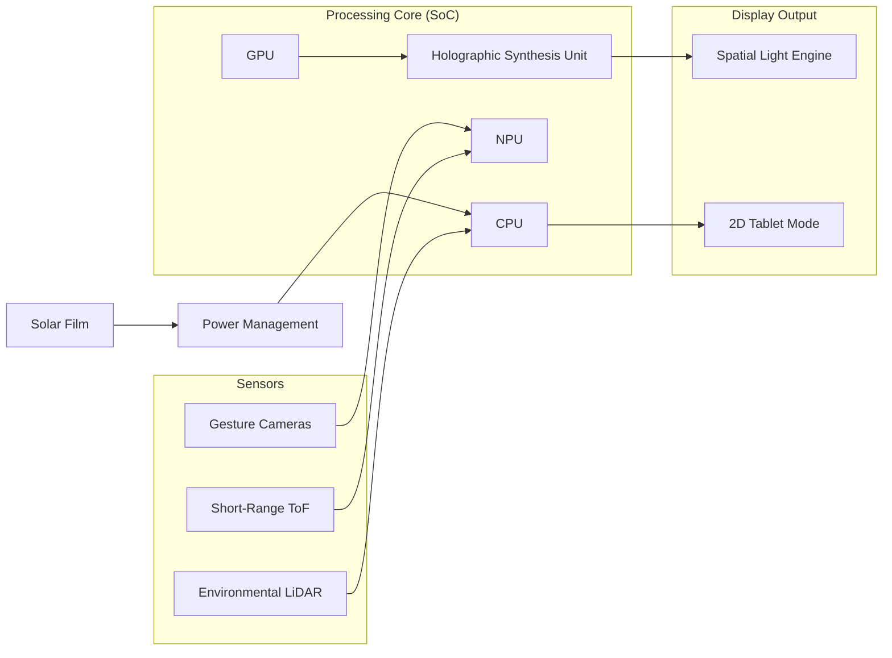

# Electronics, Sensors, and Power Systems

## Computing Architecture
BendingForce v2 requires significant computational power to calculate light fields in real-time.

### 1. System-on-Chip (SoC)
*   **Target:** High-end ARM-based architecture (e.g., custom silicon or top-tier commercial SoC like Apple M-series equivalent or NVIDIA Grace Hopper mobile variant).
*   **CPU:** 12+ Core architecture (Performance/Efficiency split).
*   **GPU:** Unified memory architecture with high TFLOPS (Teraflops) for 3D rendering.
*   **NPU (Neural Processing Unit):** Dedicated 50+ TOPS (Tera Operations Per Second) for AI-accelerated light field prediction and sensor fusion.

### 2. Spatial Rendering Pipeline
*   **Hardware Acceleration:** Real-time ray-tracing hardware and dedicated "Holographic Synthesis Units" (HSU) to calculate interference patterns for the SLE.

## Sensor Suite
Interaction with floating spatial objects requires low-latency depth and motion tracking.

### 1. Interaction Sensors
*   **LiDAR (Long Range):** For environment mapping (2m - 10m).
*   **Short-Range Time-of-Flight (ToF):** Dedicated sensor for the "Spatial Zone" (2cm - 50cm) above the screen to track hand/finger positions with sub-millimeter precision.
*   **Infrared Gesture Cameras:** Stereo-IR cameras for high-speed skeletal hand tracking.
*   **Capacitive Touch:** Integrated into the protective glass for standard 2D tablet interaction.

### 2. Environmental Sensors
*   **Ambient Light Sensor (ALS):** Adjusts SLE brightness and fluorescent amplification levels based on surrounding light.
*   **IMU (Inertial Measurement Unit):** 9-axis tracking for spatial anchoring of images during device movement.

## Power Strategy
Designed for high-performance and resiliency.

### 1. Battery System
*   **Type:** Silicon-anode Lithium-Ion or Solid-State battery for higher energy density.
*   **Capacity:** 100 Wh (Targeting 6-8 hours of mixed 2D/3D use).
*   **Supercapacitor Buffer:** Handles peak power spikes during high-intensity 3D rendering.

### 2. Energy Harvesting
*   **Integrated Solar Film:** A high-efficiency perovskite solar layer integrated into the bezel and/or backplane to provide trickle charging in field environments.

## Connectivity
*   **Wireless:** Wi-Fi 7, Bluetooth 5.4, and 5G/Satellite (Low-Earth Orbit) connectivity for remote field work.
*   **Wired:** Dual Thunderbolt 4 / USB4 ports for high-speed data and external display output.

---

## Block Diagram

