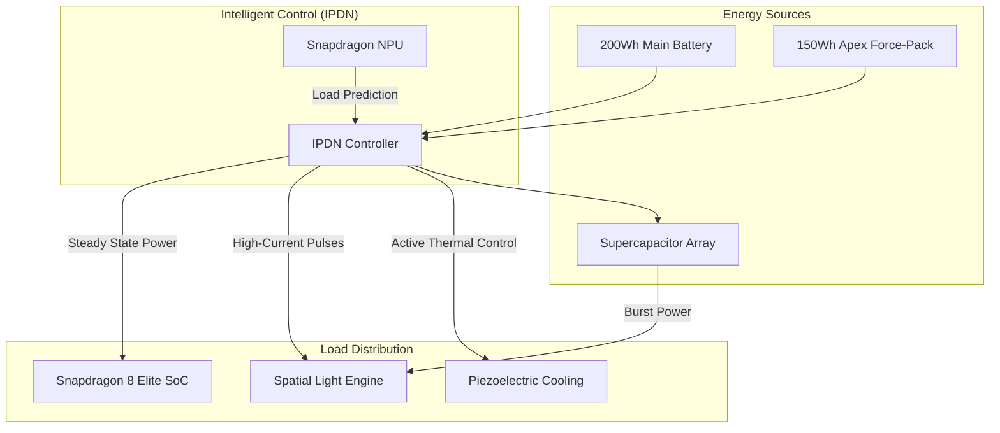
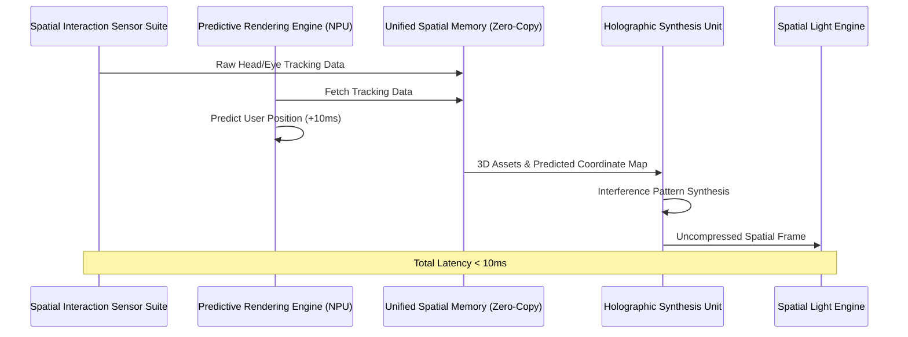
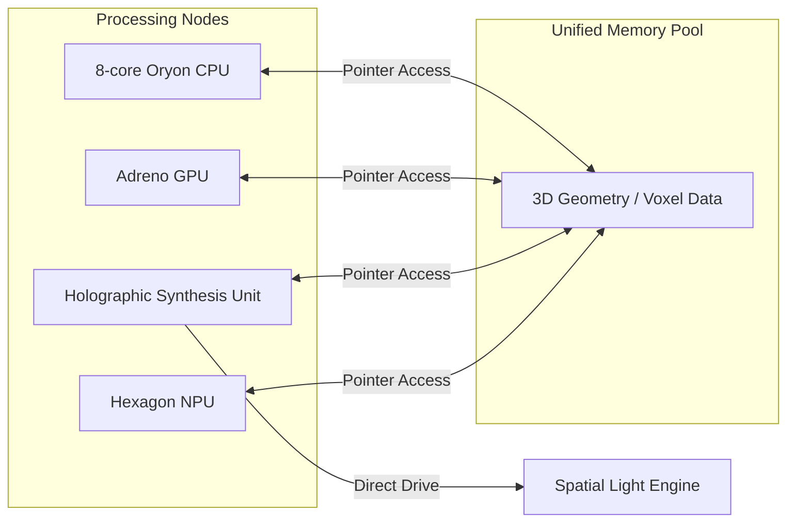

# Energy Flow and Spatial Rendering Diagrams: BendingForce v2

## 1. AI-Managed Intelligent Power Distribution Network (IPDN)
The IPDN utilizes the Snapdragon NPU to predict rendering loads and dynamically shunt power between the SoC and the Spatial Light Engine (SLE). This ensures maximum efficiency and protects the solid-state battery from high-current stress.

## 2. Spatial Rendering Data Flow (Zero-Copy Architecture)
To achieve sub-10ms "photon-to-motion" latency, BendingForce v2 utilizes a Unified Spatial Memory architecture and a Predictive Rendering Engine.

## 3. Power State Matrix (Adaptive Shunting)

| Device State | NPU Load Prediction | IPDN Action | SLE Mode |
| :--- | :--- | :--- | :--- |
| **Idle / 2D** | Minimal | Power save; Charging ASSB | 2D (LC Diffuse) |
| **Active 3D (Gaming)** | High (Sustained) | Direct shunt from ASSB + Force-Pack | 3D (Spatial) |
| **High-Brightness SOOS** | Extreme (Burst) | Supercap Discharge to SLE | 3D (Boost) |
| **Thermal Limit** | NPU Throttle Detected | Divert power to Piezo-Cooling | Power-Limited 3D |

## 4. Unified Spatial Memory (Zero-Copy) Diagram
Traditional architectures copy data between CPU, GPU, and Display buffers. BendingForce v2 eliminates this overhead.

---
*Diagram Note: These flows are optimized for the Snapdragon 8 Elite platform and the custom HSU co-processor.*
