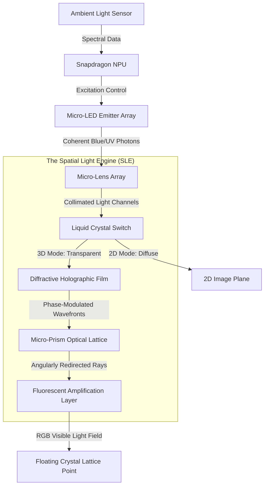
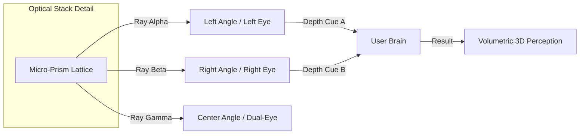
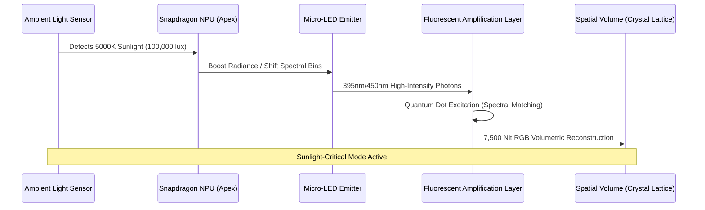

# Detailed Optical Path Diagrams: BendingForce v2

## Overview
The BendingForce v2 optical path is a sequence of light manipulations that transforms two-dimensional light into a three-dimensional volumetric field. This document visualizes the journey of a photon from its generation in the emitter array to its reconstruction as part of the "Crystal Lattice."

## 1. The Enhanced Optical Stack (Laminated Optical Sandwich)
This diagram illustrates the progression of light rays through the BendingForce v2 optical stack, including the mode-switching and ambient feedback loops.

## 2. The 3D Parallax Generation (View Angle Detail)
The **Micro-Prism Optical Lattice (MPOL)** ensures that different viewing angles receive unique light rays, creating the parallax effect for the naked eye.

## 3. The Photon's Journey: Adaptive Spectral Conversion
This sequence illustrates how the system adapts to ambient light while converting high-energy blue/UV photons into the visible RGB spatial field.

## 4. Multi-Layer Optical Specification Table

| Layer | Optical Function | Tolerance | Material Class |
| :--- | :--- | :--- | :--- |
| **Micro-LED Array** | Photon Generation | Sub-Micron | GaN-on-Si |
| **MLA** | Beam Shaping/Collimation | < 10nm RA | Nano-Imprinted Polymer |
| **LC Switch** | 2D/3D Mode Toggling | < 1ms Switching | Liquid Crystal / ITO |
| **DHF** | Phase/Depth Encoding | < 5nm SRG | Diffractive Film (NIL) |
| **MPOL** | Angular Parallax | < 0.05° Facet Angle | High-Index Polymer ($n=1.78$) |
| **FAL** | Photon Conversion | Layer Thickness < 5µm | Quantum Dot / Phosphor |

---
*Diagram Note: These visualizations represent the conceptual optical flow and are subject to refinement during physical prototyping (Phase 1 & 2).*
