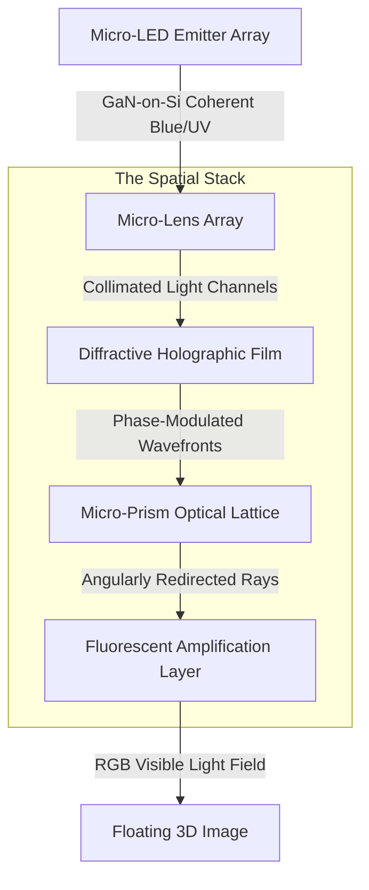

# Spatial Light Engine (SLE) Technical Specification

## Overview
The Spatial Light Engine (SLE) is the core optical subsystem of BendingForce v2. It transforms high-resolution 2D emitter data into a 3D light field via a five-layer **Laminated Optical Sandwich**. The resulting visual output is the **Crystal Lattice**, capable of projecting "Step-Out-of-Screen" (SOOS) imagery 2cm – 30cm above the surface.

## Optical Path Architecture
The light path follows a strictly controlled sequence to ensure photon coherence and precise angular distribution.

## Advanced Optical Specifications

### 1. Primary Emitter: GaN-on-Silicon Micro-LED
*   **Technology:** Monolithic Gallium Nitride (GaN) on Silicon.
*   **Resolution:** 8000 x 6000 (Native >1000 PPI).
*   **Wavelengths:** Multi-rail narrow-band Blue (450nm), Near-UV (395nm), and Infrared (850nm) for excitation and scientific emission.
*   **Peak Radiance:** >1,000,000 cd/m² (at emitter level) to ensure high visibility after stack attenuation.
*   **Switching Speed:** < 1 microsecond (essential for high-frequency 3D frame interleaving).

### 2. Micro-Lens Array (MLA): Beam Collimation
*   **Material:** Nano-imprinted high-index optical polymer ($n = 1.62$).
*   **Pitch:** 20-micron pitch, aligned 1:1 with Micro-LED clusters.
*   **Geometry:** Aspheric micro-lenses to minimize spherical aberration and maximize light throughput.
*   **Function:** Ensures all photons enter the diffractive layer at a near-perpendicular angle ($\pm 1^\circ$).

### 3. Diffractive Holographic Film (DHF): Wavefront Shaping
*   **Structure:** Surface Relief Gratings (SRG) with nano-scale binary or multilevel profiles.
*   **Grating Period:** 400nm - 700nm.
*   **Phase Modulation:** Binary Phase-Only (BPO) for maximum diffraction efficiency (>85%).
*   **Function:** Encodes depth and interference patterns. This is the primary layer responsible for the "Step-Out-of-Screen" holographic effect.

### 4. Micro-Prism Optical Lattice (MPOL): Angular Parallax
*   **Geometry:** Hexagonal lattice of micro-faceted prisms.
*   **Prism Facet Angle:** Variable ($\theta = 15^\circ$ to $45^\circ$) to cover a 120-degree viewing frustum.
*   **Refractive Index:** High-index material ($n = 1.78$) for sharp angular redirection.
*   **Function:** Generates the "Look-Around" effect by directing different light-field slices to different viewing angles.

### 5. Fluorescent Amplification Layer (FAL): Spectral Conversion & Sunlight Shield
*   **Material:** Quantum Dot (QD) or Rare-earth doped phosphors embedded in a high-clarity resin.
*   **Conversion:** Blue/UV $\rightarrow$ High-saturated RGB.
*   **Efficiency:** External Quantum Efficiency (EQE) > 90%.
*   **Sunlight Performance:** The FAL acts as a spectral buffer. By emitting highly saturated RGB light at the final surface stage, it overcomes the "wash-out" effect of 100,000-lux ambient sunlight.
*   **Spectral-Pure Mode:** A software-controlled state that optimizes the FAL's output to eliminate high-energy blue peaks (415-455nm) for surgical or long-duration use, shifting the spectrum toward circadian-neutral wavelengths.
*   **Function:** Final emission stage. By converting light at the very top of the stack, it eliminates "ghosting" and internal reflections within the lower optical layers.

## The "Crystal Lattice" Visual Standard
*   **Lattice Density:** >1,000,000 "Crystal Points" per cubic centimeter.
*   **Depth (Z-axis) Resolution:** 128 layers in the 2cm-30cm volume.
*   **Point Coherence:** High-frequency phase modulation ensures that objects appear solid and stable from any viewing angle.

## Multi-Mode Operation (2D/3D/Hybrid)
The SLE incorporates a **Liquid Crystal Switching Layer** and a **Passive Reflection Layer** integrated between the MLA and DHF.

*   **2D Mode:** The LC layer acts as a wide-angle diffuser, bypassing the diffractive and prism effects for a high-brightness 2D tablet experience.
*   **3D Mode (Active):** The LC layer is transparent, allowing the structured light field from the Micro-LED array to propagate through the SLE stack.
*   **Hybrid-Passive Mode:** In high-ambient environments, the LC layer is modulated to allow external light to hit the **Passive Reflection Layer**. This reflected light is then structured by the MPOL/DHF layers, allowing low-power visualization of 2D/3D data (e.g., e-paper style readability) without fully powering the Micro-LED emitter array.

---
*Technical Note: The alignment of the DHF and MPOL layers is critical. Any deviation >500nm results in visual "shimmer" or loss of 3D stability.*
