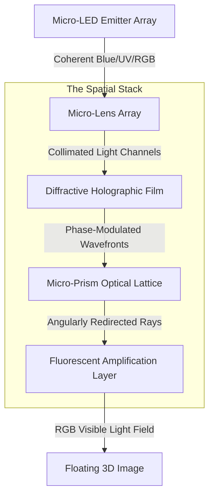

# Spatial Light Engine (SLE) Technical Specification

## Overview
The Spatial Light Engine (SLE) is the heart of BendingForce v2. It is a complex optical assembly that transforms 2D pixel data into a 3D light field. The system is designed to provide **Retina-Equivalent Spatial Resolution** and full RGB color depth.

## Optical Path Architecture
The light path follows a strictly controlled sequence to ensure photon coherence and precise angular distribution.

## Component Specifications

### 1. Micro-LED Emitter Array
*   **Technology:** GaN-on-Silicon Micro-LED.
*   **Resolution:** 8000 x 6000 (Targeting >1000 PPI).
*   **Wavelengths:** Dedicated Blue/UV (for phosphor excitation) + RGB for 2D mode.
*   **Peak Brightness:** 5,000 nits (to compensate for optical stack losses).
*   **Function:** High-speed photon generation with sub-micron pixel pitch.

### 2. Micro-Lens Array (MLA)
*   **Material:** High-index optical polymer (Nano-imprinted).
*   **Pitch:** Matched 1:1 with Micro-LED sub-pixels.
*   **Focal Length:** Optimised for 2cm - 30cm projection volume.
*   **Function:** Shapes individual emitter beams into directional light channels, preparing them for diffraction.

### 3. Diffractive Holographic Film
*   **Structure:** Nano-scale surface relief gratings (SRG).
*   **Encoding:** Phase-only spatial light modulation.
*   **Function:** Encodes depth information by manipulating the phase of the wavefront. This is where the "holographic" interference patterns are generated.

### 4. Micro-Prism Optical Lattice
*   **Geometry:** Repeating hexagonal lattice of faceted micro-prisms.
*   **Refractive Index:** Variable ($n = 1.4 - 1.8$).
*   **Function:** Redirects light rays to specific viewing angles. This enables "Look-Around" parallax, allowing multiple users to see the 3D object from different perspectives.

### 5. Fluorescent Amplification Layer
*   **Material:** Quantum Dot (QD) or Rare-earth doped phosphors.
*   **Excitation:** Blue/UV (from emitter array).
*   **Emission:** Narrow-band RGB.
*   **Function:** Converts high-energy invisible/blue light into high-intensity visible RGB. This minimizes "ghosting" and increases the perceived clarity of the spatial image.

## Dual-Mode Operation
To function as a high-end 2D tablet, the SLE incorporates a **Liquid Crystal Polarizer Layer** (integrated within the stack).
*   **2D Mode:** The polarizer aligns all rays to be perpendicular to the surface, bypassing the diffractive/prism effects for a crisp 2D image.
*   **3D Mode:** The polarizer is deactivated (or modulated), allowing the SLE layers to shape the light field into 3D space.

## Performance Targets
| Metric | Target Specification |
| :--- | :--- |
| **Spatial Resolution** | > 300 "Spatial Pixels" per inch |
| **Viewing Angle** | 120-degree horizontal / 90-degree vertical |
| **Projection Depth** | 2cm to 30cm (Optimal at 15cm) |
| **Color Gamut** | 100% DCI-P3 |
| **Refresh Rate** | 120Hz (Spatial), 240Hz (2D) |

---
*Technical Lead Note: Achieving retina-equivalent spatial resolution requires precise alignment of the MLA and the Emitter Array (sub-micron tolerance).*
