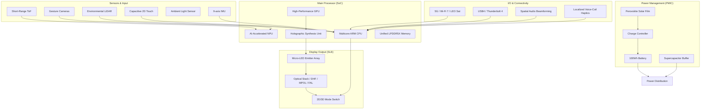
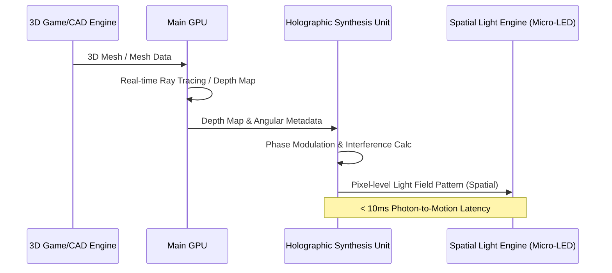

# System Block Diagram: BendingForce v2

## Overview
This document outlines the full system architecture for the BendingForce v2 Spatial Light Computing Platform. It integrates the high-performance computing core, the specialized **Holographic Synthesis Unit (HSU)**, the sensor suite, and the **Spatial Light Engine (SLE)**.

## 1. Full Tablet Architecture (System Level)

## 2. The Holographic Synthesis Unit (HSU) Data Flow
The HSU is a specialized hardware accelerator within the SoC that transforms 3D coordinate data into phase-modulated light field patterns for the SLE.

## 3. Subsystem Interconnects

| Interconnect | Protocol | Purpose |
| :--- | :--- | :--- |
| **GPU to HSU** | Proprietary High-Speed Bus | Low-latency transfer of raw depth/mesh data. |
| **HSU to SLE** | High-bandwidth DSI/MIPI | High-resolution spatial frame delivery. |
| **PMIC to SLE** | Adaptive Voltage Rail | Manages high-current pulses for the Micro-LED array. |
| **NPU to CPU** | Shared Memory | Fusion of gesture and environmental sensor data. |

---
*Diagram Note: This system block diagram represents the targeted final architecture for BendingForce v2, prioritizing high-performance spatial computing and energy efficiency.*
