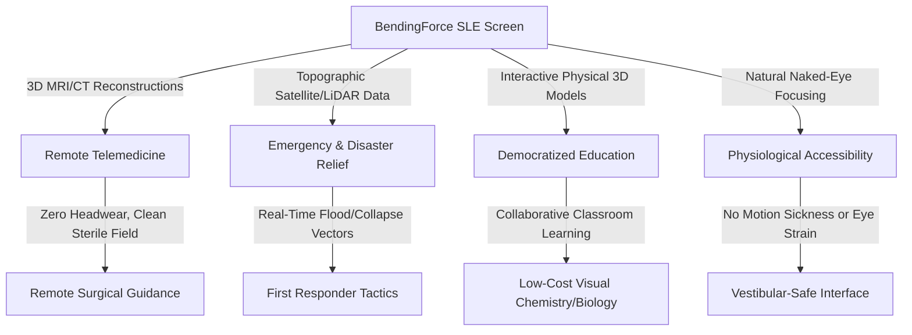

# BendingForce: Spatial Light Computing for Social Impact
## Tech for Good Strategic Proposal

### 1. Introduction: The Human Friction of Volumetric Visuals
The primary barrier to adopting spatial computing in humanitarian, educational, and medical fields is **friction**. Head-mounted displays (HMDs) impose high physical friction—requiring specialized headsets, constant calibration, cleaning, sterile field management, and tethering. They also impose high cognitive and physiological friction, often inducing headaches and motion sickness due to the Vergence-Accommodation Conflict.

By integrating the entire spatial computing experience into a single flat display, the **BendingForce Spatial Light Engine (SLE)** eliminates this friction. It projects physical, naked-eye 3D light fields (2cm to 30cm) above standard, highly portable surfaces. It is a screen-centric solution that democratizes access to spatial visualizations, making high-quality 3D data interaction available to everyone, everywhere.

This document details the direct humanitarian, medical, and educational applications of BendingForce's screen technology, demonstrating its potential as a global platform for social impact.

---

### 2. Core Humanitarian and Medical Applications

#### 2.1 Remote Telemedicine & Low-Resource Surgical Assistance
In low-income countries and rural areas, specialized surgeons are extremely scarce. When local medical practitioners perform complicated procedures, they often require remote guidance from experts.
*   **The Headset Friction in Surgery:** Standard AR/VR headsets are highly impractical in operating rooms. They violate sterile protocols when adjusted, cause fatigue over long operations, and isolate the surgeon from their physical team.
*   **The SLE Screen Solution:** A BendingForce-enabled tablet can be placed in a sterile transparent bag on an overhead arm. It renders precise, floating 3D reconstructions of blood vessels, tumors, or complex bone fractures directly from standard CT or MRI scans.
*   **Direct Collaborative Oversight:** Both the local surgical team and remote specialists (viewing a synchronized spatial projection) can coordinate on the exact depth and trajectory of incisions without sterile field disruption.

#### 2.2 Disaster Relief, Climate Modeling, and First Response
During natural disasters—such as earthquakes, flash floods, landslides, or volcanic eruptions—relief teams must navigate rapidly shifting, high-risk environments.
*   **The Limitations of 2D Elevation Maps:** Evaluating complex geographic structures (such as water runoff paths, building collapse vectors, or mudslide risk zones) on a flat 2D screen requires heavy cognitive translation, increasing the risk of fatal tactical errors.
*   **The SLE Screen Solution:** BendingForce allows field units to instantly render real-time, 3D topographical maps directly from satellite and aerial LiDAR feeds. Responders can evaluate flood channels, structural structural stability, and debris depths in physical space.
*   **Joint Tactical Coordination:** Because the micro-prism lattice allows multiple people to view the 3D map from different angles, tactical commanders can stand around a single rugged screen to point out, discuss, and map out evacuation corridors collaboratively.

#### 2.3 Interactive Spatial Education & Scientific Literacy
Traditional educational models rely on 2D diagrams to explain complex 3D phenomena. This places a high cognitive burden on students, particularly those in resource-poor environments without access to physical labs or expensive specialized models.
*   **Collaborative Learning vs. Isolative VR:** VR headsets isolate students in individual virtual bubbles, preventing natural face-to-face classroom discussions. They are also cost-prohibitive to deploy at scale.
*   **The SLE Screen Solution:** Bringing molecular bonds, double-helix DNA structures, structural engineering trusses, and astrophysical orbits into the 3D space above a shared classroom table.
*   **Direct Collaborative Manipulation:** Multiple students can manipulate a floating molecular model simultaneously using simple gestures, observing reactions and bonding vectors from their own physical viewing angles, fostering interactive group learning.

#### 2.4 Inclusive and Physiologically Safe Accessibility
Over 30% of the population suffers from varying degrees of motion sensitivity or vestibular issues when using head-mounted displays. This occurs because the eyes focus on a flat display screen centimeters away while the brain is tricked into focusing at a distance (Vergence-Accommodation Conflict).
*   **Exclusion of Sensitive Groups:** This conflict causes nausea, visual fatigue, and dizziness, completely excluding children, elderly individuals, and those with pre-existing vestibular disorders from accessing spatial computing.
*   **The SLE Screen Solution:** The SLE projects a true, physical light field. The user’s eyes focus (accommodate) and turn inward (converge) on the exact same physical plane in space where the light point is formed. This eliminates VAC at the physics level, providing a comfortable, non-fatiguing, and inclusive spatial interface.

---

### 3. Open Humanitarian Scaling Model
To ensure that this breakthrough technology is widely accessible, the BendingForce platform proposes an open-architecture, low-cost scaling pathway.

#### 3.1 Modular Lamination
By designing the SLE as a standalone, modular **Laminated Optical Sandwich**, the optical stack can be manufactured independently and laminated onto low-cost, off-the-shelf tablet motherboards. This bypasses the need for high-cost proprietary luxury chips, using standard, open-source ARM or RISC-V processors to handle spatial coordinate logic.

#### 3.2 Non-Profit & NGO Developer Ecosystem
BendingForce will release open-source spatial plugins for public domain game engines and educational frameworks. This allows NGOs, universities, and medical research foundations to build customized, localized teaching and diagnostic applications at zero licensing cost.

#### 3.3 Material Dematerialization
By leveraging the thin-film principles developed in BendingForce v1, the physical volume and weight of the display are kept to an absolute minimum. The device housing can be constructed from durable, impact-resistant recycled composites rather than expensive milled titanium, making it lightweight for drone-delivery or backpacking into remote disaster zones.

---
*BendingForce Spatial Light Engine: Bridging the physical and digital divides to empower communities worldwide.*
