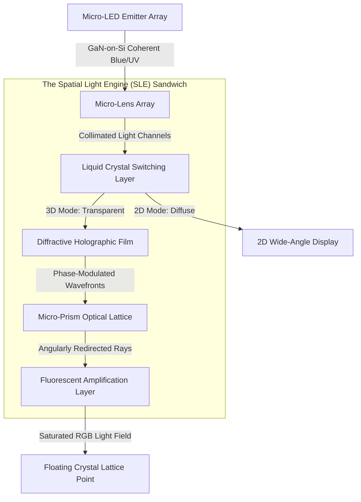

# BendingForce: Spatial Light Computing Platform
## Technical White Paper & Final Specifications: Focus on the Spatial Light Engine

### 1. Executive Summary: The Screen as the Singular Innovation
The core and singular breakthrough of the BendingForce platform is its screen technology—the **Spatial Light Engine (SLE)**. While traditional computing relies on upgrading processors, batteries, or chassis, BendingForce shifts the focus entirely to the optical interface. By modulating light at the sub-pixel level through a series of nano-engineered laminates, the SLE projects a stable, interactive holographic environment between 2cm and 30cm above a standard flat surface, requiring no glasses, headsets, or external wearables.

All other components of the device (such as the processor, battery, and casing) are designed as standard, open, and modular support hardware. The primary engineering achievement is the SLE itself, which democratizes spatial computing by transforming any generic display interface into a three-dimensional visual workspace. This technology is uniquely positioned for **Tech for Good** initiatives, providing an inclusive, accessible, and physiologically natural alternative to restrictive head-mounted displays (HMDs) for global medicine, education, and humanitarian relief.

---

### 2. Design Evolution: Evolving the Laminated Optical Stack
The BendingForce platform's core thesis is that spatial computing should be lightweight, low-power, and mechanically seamless. BendingForce v2 achieves this by directly evolving the "laminated optical stack" philosophy established in BendingForce v1.

*   **BendingForce v1 (The Passive Foundation):** Proven as an ultra-low-cost ($20), highly resilient computing sheet, BendingForce v1 demonstrated that passive optical elements (ambient light redirection, lenticular arrays, and thin-film polymers) could produce functional visuals without complex active displays.
*   **BendingForce v2 (The Active Breakthrough):** Evolves this passive philosophy into an active, high-intensity light field. Instead of heavy and expensive glass optics, v2 uses a specialized **Laminated Optical Sandwich** composed of micro-meter thin active and passive films. By laminating these films directly onto a high-density light source, the screen retains the thin, sheet-like physical profile of v1 while achieving high-fidelity active "Step-Out-of-Screen" (SOOS) imagery.

---

### 3. Spatial Light Engine (SLE) Architecture & Physics
The screen operates as a six-layer optical pipeline, guiding photons through a precise series of phase, angle, and spectral transformations.

#### 3.1 Layer 1: Monolithic Micro-LED Emitter Array
*   **Physics:** Monolithic Gallium Nitride on Silicon (GaN-on-Si) array operating at sub-micron pixel pitches, achieving over 1000 PPI.
*   **Role:** Serves as the raw photon engine, emitting narrow-band high-energy Blue (450nm) and Near-UV (395nm) wavelengths. Its ultra-high radiance (>1,000,000 cd/m² at emitter level) ensures that sufficient light-field intensity remains after propagating through the subsequent passive stack.

#### 3.2 Layer 2: Micro-Lens Array (MLA)
*   **Physics:** Aspheric micro-lenses nano-imprinted into a high-index optical polymer ($n = 1.62$) aligned 1:1 with the emitter pixels.
*   **Role:** Collimates individual divergent light beams into near-perpendicular channels ($\pm 1^\circ$ angle of incidence), preventing cross-talk before light enters the phase-modulation stage.

#### 3.3 Layer 3: Liquid Crystal (LC) Switching Layer
*   **Physics:** A high-speed, low-threshold liquid crystal layer with indium tin oxide (ITO) electrodes.
*   **Role:** Acts as the dual-mode gateway. When energized, it scatters collimated light broadly, turning the display into a standard, high-brightness 2D screen. When deactivated, it becomes completely transparent, allowing the collimated beams to pass undisturbed into the 3D optical stack.

#### 3.4 Layer 4: Diffractive Holographic Film (DHF)
*   **Physics:** Nano-scale Surface Relief Gratings (SRG) with sub-wavelength binary profiles (400nm - 700nm pitch).
*   **Role:** Modulates the phase of the incoming wavefronts. This diffractive layer is responsible for encoding the Z-axis depth, creating controlled constructive and destructive interference patterns that reconstruct the volumetric "Step-Out-of-Screen" image.

#### 3.5 Layer 5: Micro-Prism Optical Lattice (MPOL)
*   **Physics:** A hexagonal micro-faceted refractive lattice ($n \approx 1.78$) with variable facet angles ($\theta = 15^\circ$ to $45^\circ$).
*   **Role:** Redirects the phase-modulated rays into discrete angular viewing windows. This provides natural, look-around horizontal and vertical parallax, allowing multiple observers to view different perspectives of the same 3D object simultaneously.

#### 3.6 Layer 6: Fluorescent Amplification Layer (FAL)
*   **Physics:** Quantum Dot (QD) and rare-earth doped phosphors suspended in a high-clarity optical resin.
*   **Role:** Absorbs the remaining high-energy Blue/UV photons from the emitter and converts them via down-conversion into saturated, visible RGB light. Because light conversion occurs at the outermost surface of the stack, internal reflections and "ghosting" are completely eliminated, and perceived brightness is boosted by up to 40% with no additional electrical draw.

---

### 4. The "Crystal Lattice" Display Standard
The visual output generated by the SLE is quantified by the **Crystal Lattice** standard—defining the sub-pixel clarity and spatial density of the floating image.
*   **Volumetric Point Density:** Over 1,000,000 discrete light points ("Crystal Points") per cubic centimeter.
*   **Depth Z-Axis Resolution:** 128 discrete focal planes mapped within the 2cm to 30cm projection volume.
*   **Spatial Viewing Angle:** 120° horizontal and 90° vertical viewing frustum, accommodating collaborative group interactions.

---

### 5. Standard Support and Hosting Infrastructure
To emphasize the screen as the primary innovation, all non-optical systems are structured around standardized, modular architectures. Rather than relying on custom monolithic processors, the computing and power framework is designed to host the SLE on standard platforms.

*   **Modular Compute Interface:** Employs standard off-the-shelf system-on-chip architectures (such as the Snapdragon 8 Elite or general ARM/GPU combinations). A dedicated co-processing block, the Holographic Synthesis Unit (HSU), handles the raw pixel-to-phase conversion, making the screen compatible with a wide variety of hosting devices.
*   **Open Power Management:** Power distribution (IPDN) coordinates energy delivery to the high-brightness screen by utilizing standard lithium-ion or solid-state batteries, optimized via standard NPU power-load predictions.
*   **Standardized Interaction Integration:** The screen's spatial volume integrates with common sensor suites—such as Short-Range Time-of-Flight (SR-ToF) and Infrared (IR) gesture cameras—translating standard skeleton-tracking data into coordinate adjustments for the 3D volume.

---

### 6. Tech for Good: Social and Humanitarian Impact
By shifting the focus of spatial computing from heavy, isolative headwear to a natural, naked-eye holographic screen, BendingForce unlocks transformative applications for social, medical, and educational progress.

#### 6.1 Inclusive & Vestibular-Friendly Accessibility
Traditional spatial computing via VR/AR headsets forces users to experience **Vergence-Accommodation Conflict (VAC)**, leading to severe eye strain, headaches, and motion sickness. This excludes individuals with vestibular disorders, motion sensitivity, or sensory processing sensitivities. The BendingForce SLE reconstructs actual physical light fields above the screen, allowing the eye to focus and converge naturally. This provides a physiologically safe and comfortable spatial interface accessible to all users, including children and elderly individuals.

#### 6.2 Low-Resource Telemedicine and Remote Surgery
In remote clinics or field hospitals, access to specialized surgical consultation is extremely limited. The SLE allows a local medical practitioner to visualize complex 3D organ structures, bone fractures, or vascular systems directly from 3D MRI/CT scans.
*   **No Headset Barrier:** Doctors can collaborate naturally without sterile field violations caused by adjusting headsets or dealing with cables.
*   **Low-Cost Deployability:** Because the SLE can be laminated onto standard tablet-class motherboards, high-fidelity medical visualization can be shipped to low-resource communities at a fraction of the cost of HMD setups.

#### 6.3 Democratized Spatial Education
Complex disciplines such as molecular biology, organic chemistry, structural engineering, and astrophysics are notoriously difficult to teach using flat 2D textbooks. The BendingForce screen brings molecular bonds, engineering components, and planetary systems into physical space above the tablet.
*   **Collaborative Classroom Learning:** Unlike VR headsets which isolate students, BendingForce allows a group of students to sit around a single device, pointing, discussing, and interacting with the same floating 3D model together.
*   **Low Barrier to Entry:** Built on the low-cost principles of v1, this screen technology can scale to resource-strapped educational institutions worldwide.

#### 6.4 Environmental Mapping & Disaster Response
During climate disasters (such as flash floods, earthquakes, or wildfires), emergency responders need to quickly interpret complex topographic data.
*   **Topographic Volumetric Visualization:** The SLE renders real-time, 3D terrain models from satellite and LiDAR data. First responders can immediately evaluate flood vectors, evacuation routes, and structural collapse hazards in 3D, accelerating life-saving decision-making in the field.

---
*Version 2.0 - Tech for Good Technical White Paper*
